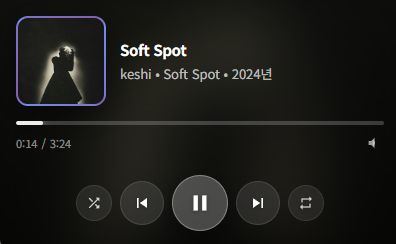

# 🎵 YouTube Music PIP Player

유튜브 뮤직을 Picture-in-Picture(PIP) 모드로 즐길 수 있는 크롬 확장 프로그램입니다.



## ✨ 주요 기능

- **PIP 미니 플레이어**: 다른 작업을 하면서도 음악을 컨트롤할 수 있습니다
- **재생 컨트롤**: 재생/일시정지, 이전 곡, 다음 곡
- **셔플 & 반복**: 셔플 및 반복 모드 전환
- **진행바**: 클릭하여 원하는 위치로 이동
- **실시간 업데이트**: 앨범 아트, 곡 제목, 아티스트 정보 표시
- **아름다운 UI**: 모던한 그라디언트 디자인

## 🚀 설치 방법

### 1. 아이콘 생성

1. `generate-icons.html` 파일을 브라우저에서 엽니다
2. **"모든 아이콘 다운로드"** 버튼을 클릭합니다
3. 다운로드된 `icon16.png`, `icon48.png`, `icon128.png` 파일을 `icons` 폴더에 넣습니다

### 2. 크롬에 확장 프로그램 로드

1. Chrome 브라우저에서 `chrome://extensions/` 페이지로 이동합니다
2. 오른쪽 상단의 **"개발자 모드"**를 활성화합니다
3. **"압축해제된 확장 프로그램을 로드합니다"** 버튼을 클릭합니다
4. 이 폴더(`Youtube_music_player`)를 선택합니다

## 📖 사용 방법

### 방법 1: 확장 프로그램 아이콘 클릭
1. [YouTube Music](https://music.youtube.com)에 접속합니다
2. 크롬 도구 모음에서 확장 프로그램 아이콘을 클릭합니다
3. **"PIP 모드 시작"** 버튼을 클릭합니다

### 방법 2: 플레이어 바 버튼
1. YouTube Music 페이지의 하단 플레이어 바에서
2. 오른쪽에 추가된 PIP 버튼(🖼)을 클릭합니다

## 🎮 PIP 창 컨트롤

| 버튼 | 기능 |
|------|------|
| ◀◀ | 이전 곡 |
| ▶ / ⏸ | 재생 / 일시정지 |
| ▶▶ | 다음 곡 |
| 🔀 | 셔플 모드 |
| 🔁 | 반복 모드 |

- **진행바 클릭**: 원하는 위치로 이동
- **X 버튼**: PIP 창 닫기 (마우스 올리면 표시)

## ⚠️ 참고 사항

- Document Picture-in-Picture API는 Chrome 116 이상에서 지원됩니다
- 구 버전 브라우저에서는 기본 비디오 PIP 모드로 폴백됩니다
- YouTube Music 페이지에서만 동작합니다

## 📁 파일 구조

```
Youtube_music_player/
├── manifest.json          # 확장 프로그램 설정
├── content.js             # 유튜브 뮤직 페이지 스크립트
├── background.js          # 백그라운드 서비스 워커
├── popup.html             # 팝업 UI
├── popup.js               # 팝업 로직
├── styles.css             # 컨텐츠 스타일
├── generate-icons.html    # 아이콘 생성 유틸리티
├── icons/
│   ├── icon.svg           # SVG 아이콘
│   ├── icon16.png         # 16x16 아이콘
│   ├── icon48.png         # 48x48 아이콘
│   └── icon128.png        # 128x128 아이콘
└── README.md              # 이 파일
```

## 📜 라이선스

MIT License

---


