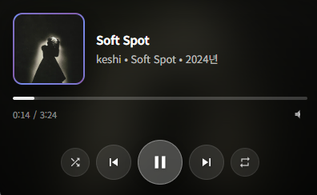

# YouTube Music PIP Player

유튜브 뮤직을 Document Picture-in-Picture 중심으로 제어할 수 있는 Chrome 확장 프로그램입니다. 브라우저가 Document PiP를 지원하지 않거나 사용자 제스처 조건을 만족하지 못할 때는 video PiP 폴백으로 동작합니다.



## 주요 기능

- YouTube Music 플레이어 바에 PIP 토글 버튼 추가
- 팝업과 페이지 버튼에서 동일한 PIP 상태 표시
- 재생/일시정지, 이전/다음 곡, 셔플, 반복, 시크, 볼륨 제어
- Document PiP 우선, 지원되지 않을 때 video PiP 폴백
- 페이지 재렌더링과 SPA 내비게이션 이후에도 버튼 재삽입

## 설치 방법

1. Chrome에서 `chrome://extensions/`로 이동합니다.
2. 오른쪽 위의 `개발자 모드`를 켭니다.
3. `압축해제된 확장 프로그램을 로드합니다`를 선택합니다.
4. 현재 저장소 루트 폴더 `YouTubeMusic_PIP_Player`를 선택합니다.

## 사용 방법

1. `https://music.youtube.com/` 탭을 엽니다.
2. 방법 1: 확장 팝업에서 `PIP 모드 시작` 버튼을 누릅니다.
3. 방법 2: YouTube Music 플레이어 바 오른쪽에 추가된 PIP 버튼을 누릅니다.
4. 키보드 단축키 `Ctrl+Shift+Y` 또는 macOS의 `Command+Shift+Y`로 현재 Music 탭을 토글할 수 있습니다.

## 동작 범위

- Chrome 116 이상: Document Picture-in-Picture를 우선 시도합니다.
- Document PiP를 사용할 수 없거나 브라우저가 제스처를 막는 경우: 기본 video PiP로 폴백합니다.
- 사용자가 확장을 설치한 뒤 기존 YouTube Music 탭이 이미 열려 있었다면, 탭을 한 번 새로고침해야 콘텐츠 스크립트가 연결됩니다.

## 개발 툴링

이 저장소는 Node LTS 환경을 가정하고 아래의 경량 품질 게이트를 포함합니다.

```bash
npm install
npm run lint
npm run format:check
npm test
```

## 수동 QA 체크리스트

- Music 탭이 아닐 때 팝업이 `YouTube Music 열기` 상태를 보여주는지 확인
- Music 탭에서 팝업 토글과 페이지 버튼 토글이 같은 상태를 보여주는지 확인
- Document PiP와 video PiP 폴백이 각각 정상적으로 열리고 닫히는지 확인
- 재생/일시정지, 이전/다음 곡, 셔플, 반복, 시크, 볼륨/음소거가 PIP 창에서 동작하는지 확인
- 탭 새로고침과 YouTube Music SPA 내비게이션 후에도 PIP 버튼이 다시 나타나는지 확인
- 한국어/영어 UI 환경에서 셔플과 반복 버튼이 계속 동작하는지 확인

## 파일 구조

```text
YouTubeMusic_PIP_Player/
├── manifest.json
├── background.js
├── helpers.js
├── content.js
├── styles.css
├── popup.html
├── popup.css
├── popup.js
├── generate-icons.html
├── tests/
│   └── helpers.test.js
└── icons/
```

`generate-icons.html`은 아이콘 생성용 보조 도구이며 런타임에는 사용되지 않습니다.
